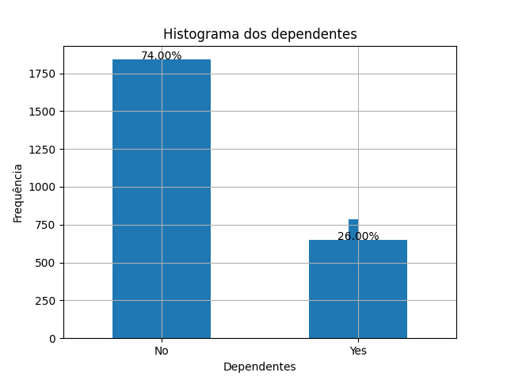
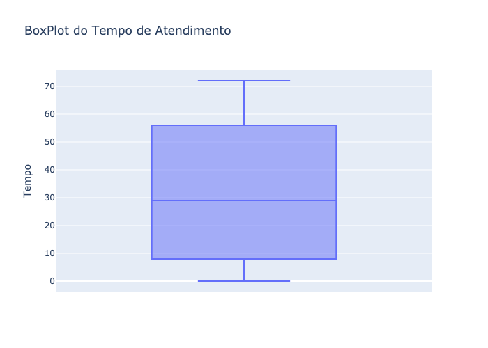
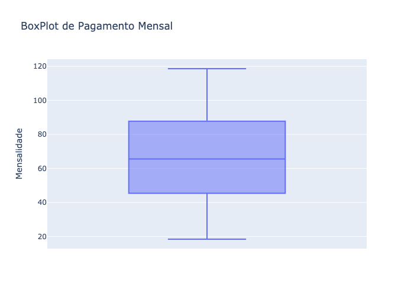
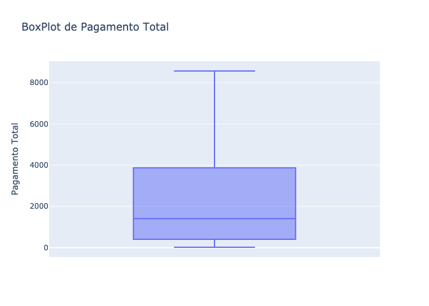
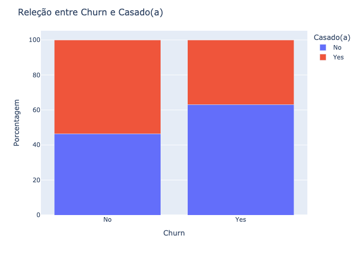
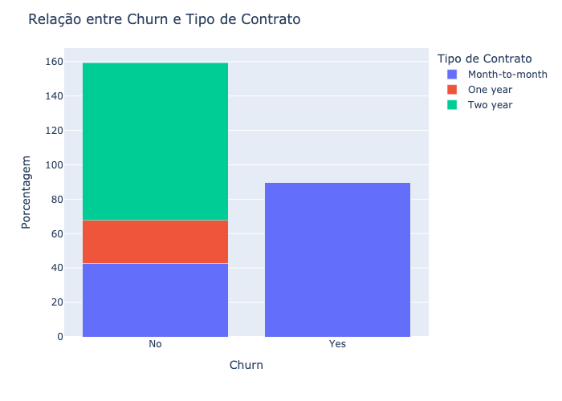
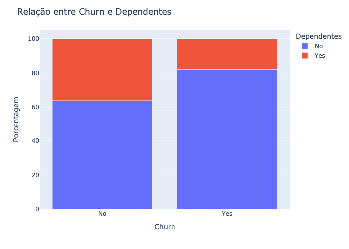
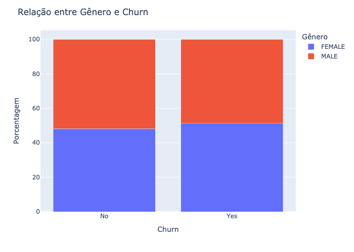
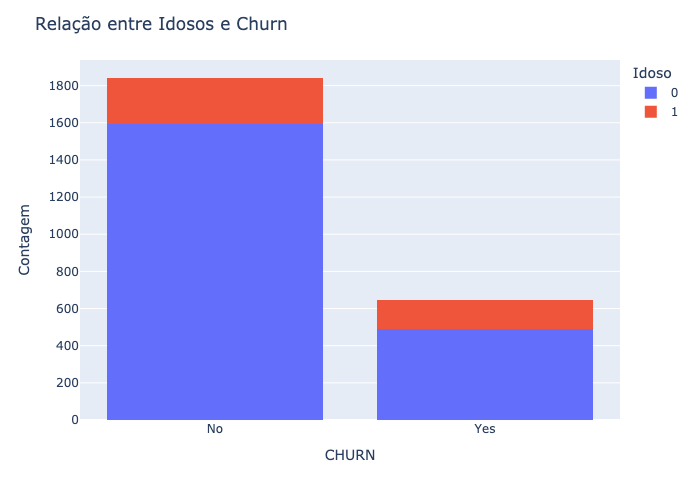

Análise de Churn em uma Empresa de Telecomunicações

Este repositório contém um script em Python para analisar dados de churn em uma empresa de telecomunicações. Ele realiza análises estatísticas, univariadas e bivariadas, além de identificar outliers e salvar gráficos como imagens para facilitar a visualização.

## Requisitos

Certifique-se de ter as seguintes bibliotecas instaladas:

- pandas
- seaborn
- matplotlib
- plotly

Você pode instalá-las usando:
```bash
pip install pandas seaborn matplotlib plotly
```


Descrição do Script

O script realiza as seguintes etapas:


## Carregamento dos Dados

- Lê o arquivo arquivo_analise_telecon.csv para um DataFrame.

- Exibe as 10 primeiras linhas e estatísticas descritivas usando describe().


## Análise Univariada

Distribuição de Churn


Distribuição de Dependentes




## Identificação de Outliers

- Utiliza gráficos do tipo boxplot para identificar outliers nas seguintes variáveis:

Tempo de Atendimento




Pagamento Mensal



Pagamento Total




## Análise Bivariada

Churn x Casado(a)



Churn x Tipo de Contrato



Churn x Dependentes



Churn x Gênero



Churn x Idosos

